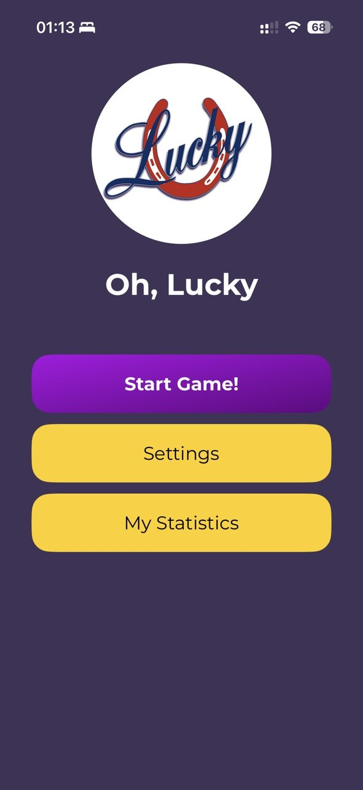
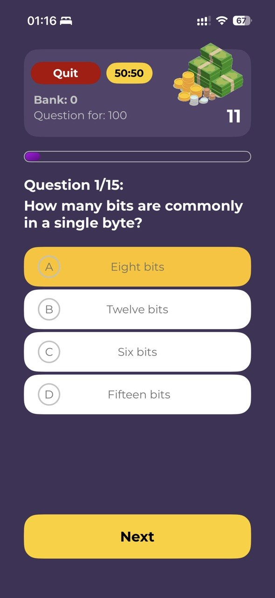
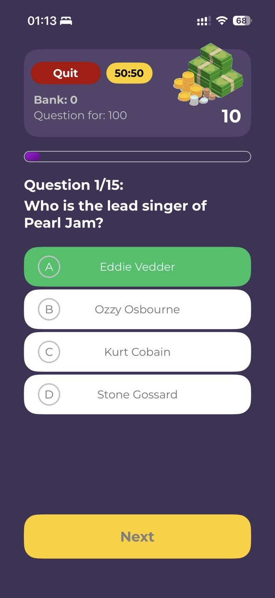
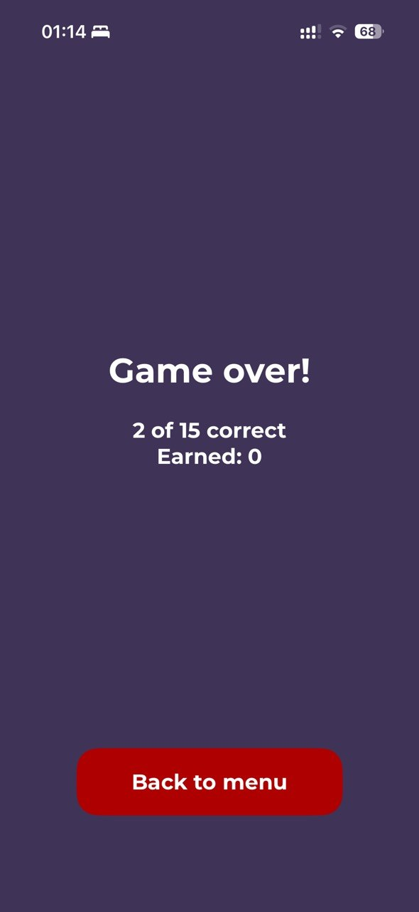
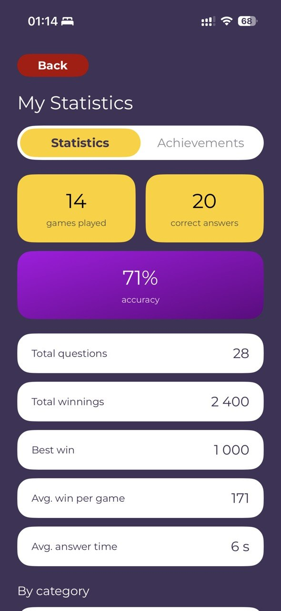
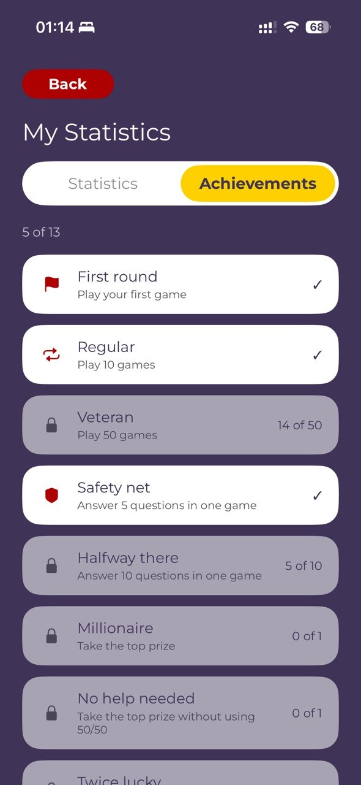

# Oh Lucky Quiz

Квиз-приложение для iOS на UIKit (MVC, без сторибордов). Игрок отвечает на вопросы по нарастающей сложности, набирая банк от 100 до 1 000 000, с несгораемыми суммами, одной подсказкой 50/50 и таймером на ответ.

## Скриншоты

<p>
  
  
  
  
  
  
</p>

## Функционал

- Вопросы трёх уровней сложности, подгружаются последовательно по мере продвижения игрока
- Текущий банк (последняя взятая ступень) снижаются до несгораемой суммы при досрочном выходе или при проигрыше
- Подсказка 50/50 одна на партию
- Таймер на ответ с тиканьем на последних секундах
- Звук и хаптика включаются раздельно
- Офлайн-режим: 330 вопросов на английском и русском, встроены в приложение
- Для русского языка офлайн включается автоматически. OpenTDB не отдаёт вопросы на русском
- 13 достижений, статистика игр (лучшая серия, средний банк, точность по категориям и т.д.)
- Онбординг при первом запуске
- Настройки: звук/хаптика, офлайн-режим, язык, ссылки на Privacy Policy / Terms of Service / поддержку

## Архитектура

MVC. Controller - только данные и навигация, ноль верстки.
 UIView- подклассы без ссылок на свой контроллер: наверх сообщают через closure-колбэки (`onNextTapped`, `onFinishTapped` и т.п.), контроллер сам их разбирает в `[weak self]`-блоках. Верстка целиком кодом, через `NSLayoutConstraint`.

Единственная точка DI во всём проекте — `GameViewController.init(networkService: QuestionNetworkServiceType, category:)`: в проде подставляется реальный `QuestionNetworkService`, в тестах — фейковый.

## Инженерные решения

- **Таймер вопроса считается от `Date`-дедлайна, а не тиками.** `Timer` останавливается, когда приложение уходит в фон — а дата дедлайна остаётся верной. Заодно это даёт таймер, тестируемый без реального run loop: тесты просто подставляют `now:`.
- **Персистентная статистика переживает добавление новых полей.** `QuizStats` синтезированный `Decodable` не использует — вместо него ручной `init(from:)` в extension с `decodeIfPresent(...) ?? 0` на каждое поле. Причина: `StatsStore.load()` глушит ошибку декодирования через `try?`, а синтезированный инициализатор бросает исключение на любом отсутствующем ключе — то есть без этого добавление нового поля статистики молча стирало бы всю накопленную у игрока историю.
- **Источник вопросов конфигурируется удалённо.** `QuestionNetworkService` перед первым запросом подтягивает `apiBaseURL` из JSON-файла на GitHub Pages и кэширует его в памяти. Это позволяет сменить источник вопросов без релиза в App Store.
- **Отказоустойчивость сети — с явным согласием игрока.** При ошибке сети `promptOfflineFallback` не переключает на офлайн тихо, а спрашивает игрока через `UIAlertController`; мост между колбэками алерта и `async` сделан через `withCheckedContinuation`.
- **Локализация — через явный бандл, а не через системную локаль.** У приложения есть собственный переключатель языка, независимый от языка системы. Обычный `String(localized:)` резолвился бы против системной локали и игнорировал бы выбор игрока — поэтому используется обёртка `localized(_:)`, которая берёт перевод из `AppLanguage.current.bundle`.

## Тестирование

Swift Testing (`@Test`, `#expect`), не XCTest. Корневой `@Suite` помечен `.serialized` — тесты трогают общий `UserDefaults`, и параллельный запуск бы их поломал. Изоляция состояния — вручную написанные снапшоты (`StatsSnapshot`, `AchievementsSnapshot`, `LanguageSnapshot`): сохраняют значение в `init()`, чистят его, восстанавливают в `defer`. Есть отдельный `@MainActor`-интеграционный тест, поднимающий реальный `GameViewController`.

## Стек

- Swift 5, UIKit, iOS 17+
- `URLSession` + `Codable`, `async/await`
- Без сторонних зависимостей — ни CocoaPods, ни SPM
- [Open Trivia DB](https://opentdb.com) как источник вопросов

## Структура проекта

```
OhLuckyQuiz/
├── Controller/    — UIViewController-подклассы: данные и навигация
├── View/          — UIView-подклассы, верстка кодом, без ссылок на контроллер
├── Model/         — доменное состояние и персистентность (игра, статистика, достижения, настройки)
├── Networking/    — APIClient, QuestionNetworkService, офлайн-провайдер вопросов
├── Components/    — переиспользуемые ячейки таблиц
├── Extensions/    — вспомогательные расширения (шрифты, кнопки, радиусы, градиенты)
└── Resources/     — офлайн-банк вопросов (EN/RU), звуки
```
